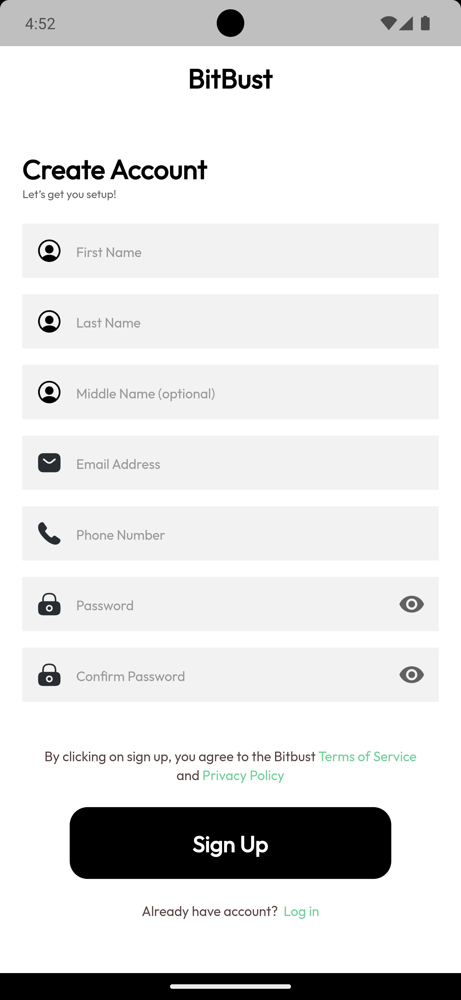
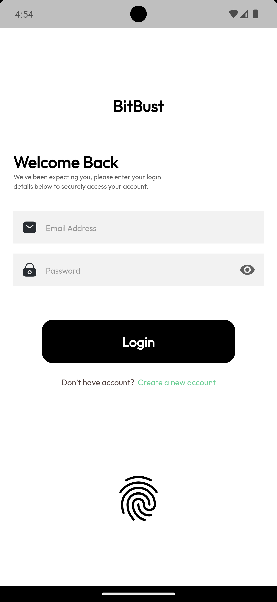
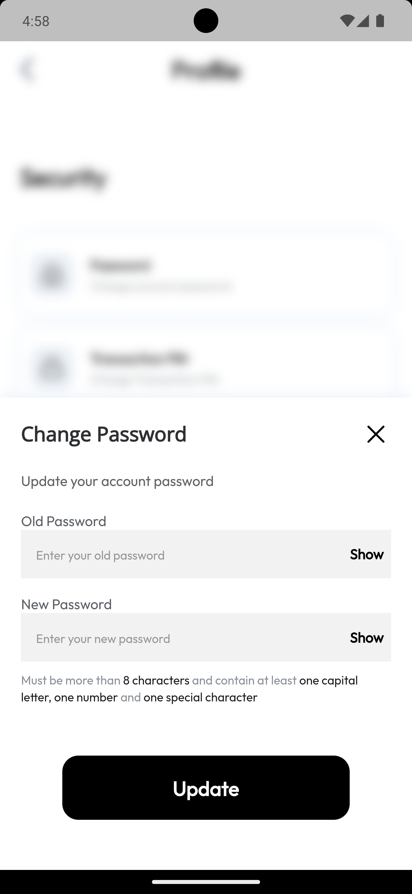
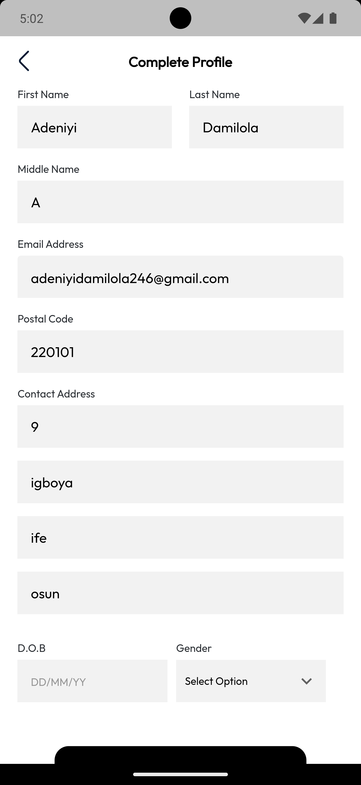
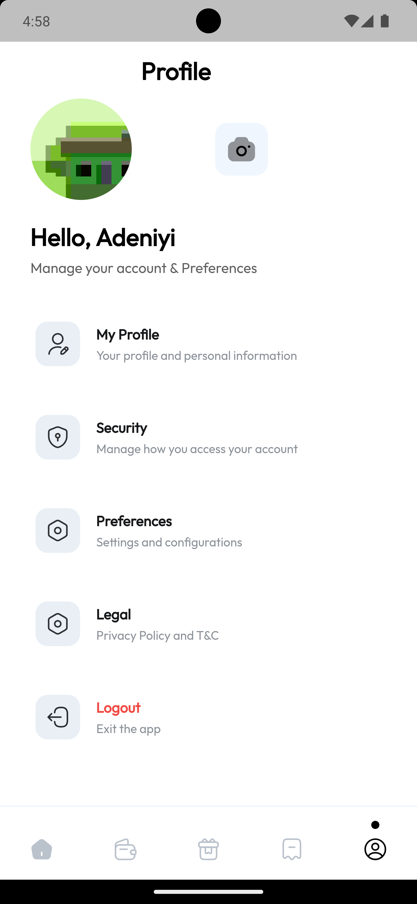

# bitbust

A new Flutter project.

## Getting Started

This project is a starting point for a Flutter application.

A few resources to get you started if this is your first Flutter project:

- [Lab: Write your first Flutter app](https://docs.flutter.dev/get-started/codelab)
- [Cookbook: Useful Flutter samples](https://docs.flutter.dev/cookbook)

For help getting started with Flutter development, view the
[online documentation](https://docs.flutter.dev/), which offers tutorials,
samples, guidance on mobile development, and a full API reference.

Authentication: i designed, validated user inputs and integrated APIs for the Signup and login screen

- 
- 

Change Password: I designed screen according to the design to allow users to change password and integrate associated API

- 

User Data Update: I designed screen for user to update their information and integrate API. Users can also update their picture on the profile page

- 
- 

Notification: I designed screen to display in-app notifications and also integrate push notifications service
